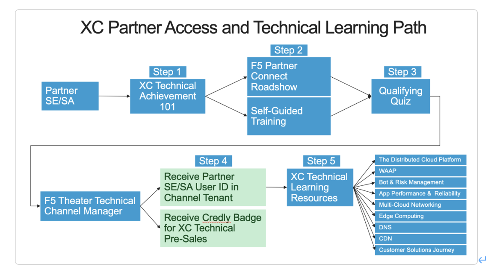

# F5 Distributed Cloud (XC) - Technical Learning Path

請填表單輸入您的email address,我們將發送email 給您開啟Lab
(https://docs.google.com/forms/d/e/1FAIpQLSerY8bDS5rSacM6t_Y8JlfFxMdqggUM41rz7BPJWpgh66URFQ/viewform?usp=sf_link)

### Learning Path
1.	Begin the journey by completing the XC Technical Achievement 101 introduction material.
2.	Attend a theater based F5 Partner Connect Roadshow or work through the online Self-Guided Training.
3.	Take the qualifying F5 XC Technical Learning Path Quiz and Survey.
4.	Receive notification that your account has been created for Login to the F5 Distributed Cloud Channel Tenant, and receive your Credly Accreditation Badge.

## Step 1 - F5 Distributed Cloud (XC) Technical Overview 101

Step one in the XC Partner Access and Technical Learning Path is for the Partner SE/SA to complete the F5 XC Technical Overview 101.
Steps to take the F5 XC Technical Overview 101:

1.	In your browser navigate to the F5 Teachable website.
   https://trainingf5cloud.teachable.com/
3.	If you do not already have an account for this site, create an account by clicking "Sign Up".
4.	Once logged in search "Technical Overview 101" in the search field.
5.	Begin working through the "F5 Distributed Cloud Technical Overview 101" material.
6.	Once complete proceed to Step 2 of the F5 Distributed Cloud - Technical Learning Path on Partner Central.

## Step 2 - F5 Distributed Cloud (XC) - Partner Connect Roadshow and Self-Guided Training

### F5 Partner Connect Roadshow – Distributed Cloud (XC) Agenda
  
Presentations: Parnter Connect XC Technical Roadshow Presentation.pptx

下載ppt
https://docs.google.com/presentation/d/1SRCgxaOscASl21-IvC6ibKwqf2A15iWB/edit?usp=sharing&ouid=114422275310448597514&rtpof=true&sd=true

- F5 Distributed Cloud Service – Overview (30 min.)
- F5 Distributed Cloud Web App and API Protection (WAAP) Deep Dive (1 hr.)
- F5 Distributed Cloud Bot Defense Deep Dive (30 min.)
- F5 Distributed Cloud Multi-Cloud Networking Deep Dive (1 hr.)
- F5 Distributed Cloud CDN Deep Dive (30 min.)
- F5 Distributed Cloud Synthetic Monitoring Deep Dive (30 min.)
 
### Labs:
 
#### Lab 1 (https://clouddocs.f5.com/training/community/f5xc/html/)

UDF Course link  https://udf.f5.com/course/15d09870-8bc1-4d96-ae62-387e6aeec56e#schedule
 
F5 Distributed Cloud – Introduction to Deployment Models and Services
                
Introduction : Accessing F5 Distributed Cloud Console
Lab 1:  Deploying F5 Distributed Cloud Proxy Services to Securely Deliver a Public Endpoint
Lab 2: Deploying an AWS VPC Site
Lab 3: Protecting a Private Endpoint
Lab 4: Introduction to F5 Distributed Cloud DNS
Lab 5:  Introduction to Observability
Lab 6: Introduction to Content Delivery Networks (CDN)
Lab 7: Introduction to MCN
Conclusion
 
#### Lab 2 (https://clouddocs.f5.com/training/community/f5xc/html/)
 
F5 Distributed Cloud – WAF/WAAP Deeper Dive
Introduction:  Accessing F5 Distributed Cloud Console
Lab 1:  Deploying and Managing F5 Distributed Cloud Web Application Firewall Configuration
Lab 2:  Reviewing Signature-based Bot Strategies and enabling F5 Distributed Cloud BotDefense
Lab 3:  Exploring Service Policies
Lab 4: Malicious Users
Lab 5:  Rate Limiting
Lab 6: API Discovery & Protection
Lab 7: Client-Side Defense
Conclusion
 
## Step 3 - F5 Distributed Cloud (XC) Technical Learning Path Quiz

The F5 Distributed Cloud (XC) - Channel Partner Quiz is the gating function for partner SEs/SAs to gain access to the Channel Tenant on the XC platform. Upon successful completion Channel Tenant admins will create your XC Tenant ID and submit your information to receive a F5 Credly badge for your achievement.
Once partners have completed the prerequisite training in Steps 1 & 2 they may take the XC - Channel Partner Quiz.  

https://partnercentral.f5.com/explore/1037857?popupstate=%7B%22state%22:%22app.viewContent%22,%22srefParams%22:%7B%22source%22:13,%22sourceId%22:2184839,%22sourceType%22:null,%22assetId%22:2201822,%22assetComponentId%22:2206885%7D%7D

fill out survey 
https://forms.office.com/r/NJitAitWXv

Don’t forget to sign up for DevCentral and join the XC Group – keep the conversation going!! 
(https://community.f5.com/) Groups - Community Groups – Distributed Cloud Users
•	Link to Quiz (in LearnF5)
We also request feedback on the F5 Distributed Cloud Technical Learning Path. Please take the following survey once complete with the quiz.
•	Link to Survey
Upon successful completion of the quiz we will review the results and create your XC Channel Tenant ID as well as submit your information to receive a F5 Credly badge for your achievement. This process is done weekly on Mondays for the candidates of the week prior. You will be notified via email when your ID is ready and you can begin your journey with the Learning Resources in Step 5.

## Step 4 - F5 Distributed Cloud (XC) Channel Partner Accreditation and User Community

Upon successful completion of the XC Channel Partner Quiz, partner SE/SAs will received their Credly badge for the Learning Path and notification that their ID has been created inside the XC Channel Tenant. There they can then begin to work though learning how to do demos for their customers. It is also recommended for them to sign-up for the DevCentral XC User Community.

Credly Accreditation Badge
Upon quiz completion and account review you will receive an email with directions on how to claim your Credly badge.

XC Channel Tenant Access
Once you have received your user ID from your theater admin, you can navigate to the XC Channel Tenant space and log in.

DevCentral - XC User Community
Go to F5 DevCentral and from the menu select Groups, Community Groups, Distributed Cloud User and create and account.

## Step 5 - F5 Distributed Cloud (XC) Partner Learning Resources

The following resources are intended to provide additional understanding of the use cases and advantages of the XC platform

You can use this material to understand and work through solutions you may need to provide for your customer.  The material is not intended to be consumed in any particular order.

 
 
 
 
